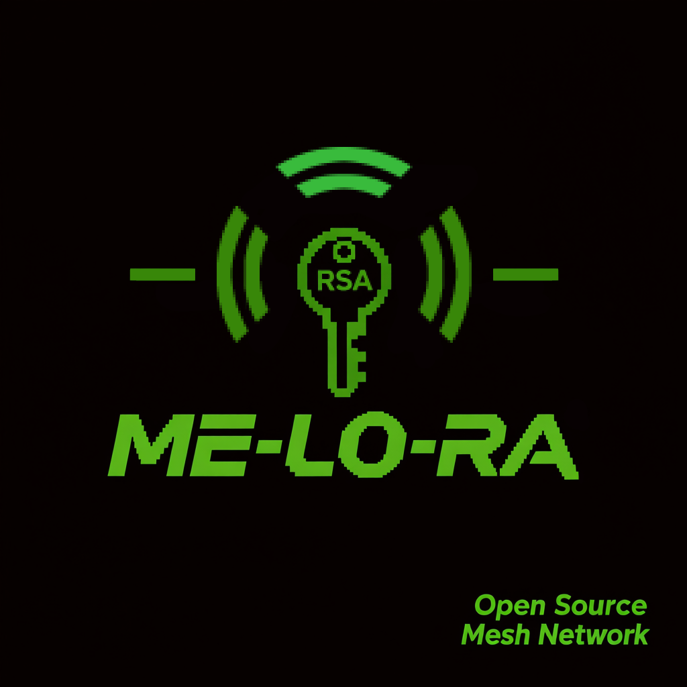

  
  <h1>ME-LO-RA NETWORK</h1>
  
<em>Анонимная mesh-сеть для безопасной передачи сообщений по радиоканалу</em>

---

## 📌 Содержание

- [Что это?](#-что-это)
- [Зачем это нужно?](#-зачем-это-нужно)
- [Основа проекта](#-основа-проекта)
- [Как это работает?](#-как-это-работает)
- [Безопасность и шифрование](#-безопасность-и-шифрование)
- [Технические ограничения](#-технические-ограничения)
- [Что нужно для старта?](#-что-нужно-для-старта)
- [Схема подключения](#-схема-подключения)
- [Модификации и кастомизация](#-модификации-и-кастомизация)
- [Генерация ключей](#-генерация-ключей)
- [Питание и корпус](#-питание-и-корпус)
- [Предыстория](#-предыстория)
- [Важно!](#-важно)
- [Обратная связь](#-обратная-связь)

---

## ❓ Что это?

**ME-LO-RA NETWORK** - это mesh-сеть на базе **ESP32** и радиомодуля **LoRa (SX1278)**, предназначенная для передачи текстовых сообщений между абонентами по радиоканалу с использованием:

- асимметричного шифрования **RSA**,
- цифровой подписи на основе **SHA-256**,
- гарантии доставки сообщений.

---

## 🛡️ Зачем это нужно?

Проект создан для **безопасной и анонимной** передачи сообщений в условиях отсутствия или недоступности традиционных каналов связи (например, при отключении мобильного интернета).

---

## ⚙️ Основа проекта

- **Микроконтроллер**: ESP32
- **Радиомодуль**: LoRa SX1278
- **Дополнительно**: OLED-дисплей, кнопка.

---

## 🔄 Как это работает?

- ESP32 создаёт точку доступа Wi-Fi и разворачивает веб-интерфейс для отправки/приёма сообщений.
- Все сообщения шифруются с использованием **RSA** и подписываются цифровой подписью, проверка целостности передачи осуществляется **SHA-256**.
- Получатель проверяет подпись и расшифровывает сообщение.
- Для подтверждения доставки отправляется **обратное подписанное сообщение**, защищающее от подмены факта получения третьей стороной.
- Сеть работает по принципу **mesh**: сообщения могут ретранслироваться через промежуточные узлы.

---

## 🔐 Безопасность и шифрование

- Поддерживается **любая битность RSA-ключей**, но из-за ограничений производительности ESP32 рекомендуется использовать **64-128 бит**.
- Дополнительная мера защиты - **ограниченный и перемешанный набор символов**. Его можно изменить, но необходимо **синхронизировать** между всеми участниками переписки, для работы ретрансляции это не обязательно.
- Открытый ключ и псевдоним публикуются в открытом виде (например, через широковещательный канал ME-LO-RA).
- Никто из участников сети не знает кто отправитель пакета, известен лишь псевдоним получателя.
- Для дополнительной безопасности рекомендуется убрать всю отладочную информацию, выводимую в параллельный порт посредством *Serial.print* и *Serial.println*.

> ⚠️ Без синхронизации набора и порядка символов в алфавите расшифровка сообщений между абонентами работать не будет. Рекомендуется оставить все как есть.

---

## 📏 Технические ограничения

| Условия                     | Дальность |
|-----------------------------|-----------|
| Плотная городская застройка | ~500 м    |
| Лес                         | ~1000 м   |
| Прямая видимость            | до 5000 м |

- **Количество ретрансляторов** не ограничено.

---

## 🚀 Что нужно для старта?

1. Собранное устройство на базе ESP32 + LoRa SX1278.
2. Уникальный **псевдоним** (никнейм). При совпадении - чужие сообщения будут восприниматься как битые и останутся нечитаемыми.
3. Сгенерированная пара **RSA-ключей** (публичный и приватный).
4. Обмен **публичным ключом** и псевдонимом через открытый канал (например, широковещательный ME-LO-RA).

> Чем больше участников сети знают ваш публичный ключ и псевдоним - тем эффективнее работает mesh-ретрансляция.

---

## 🔌 Схема подключения

> ⚠️ **Внимание**: Приведённая схема питания ESP32 **не рекомендуется**. Используйте на свой страх и риск!

> ✅ **Рекомендация**: Питайте ESP32 через пин **5V/VIN**, используя повышающий преобразователь до 5 В. Если такой возможности нет, то подводите питание от батареи напрямую к пину **5V/VIN**, в этом случае контроллер будет отключаться при напряжении батареи порядка 3.9 В, но точно не сгорит.

### LoRa SX1278

| ESP32 | LoRa SX1278 |
|-------|-------------|
| GND   | GND         |
| D5    | NSS         |
| D2    | DIO0        |
| D18   | SCK         |
| D19   | MISO        |
| D23   | MOSI        |
| D14   | RST         |

>  ⚠️ Ни в коем случае **не питайте** модуль Lo-Ra от **встроенного стабилизатора напряжения 3.3V** на ESP-32, в противном случае контроллер может сгореть.

### OLED

| ESP32 | OLED |
|-------|------|
| 3.3V  | VCC  |
| GND   | GND  |
| D22   | SCL  |
| D21   | SDA  |

### Кнопка

| ESP32 | Кнопка |
|-------|--------|
| D16   | Контакт 1 |
| GND   | Контакт 2 |

- **D35** - пин для измерения уровня заряда аккумулятора, подключается через делитель напряжения, как на схеме. Резисторы можно использовать с бОльшим напряжением (например 50 кОм)

---

## 🎨 Модификации и кастомизация

Проект легко адаптируется под ваши нужды:
- Веб-интерфейс можно полностью изменить (стили, логика и т.д.).
- Главное - сохранить структуру **POST-запросов** к ESP32.

---

## 🔑 Генерация ключей

В репозитории приложен Python-скрипт для генерации RSA-ключей на основе простых чисел до **31 бита**.  
Поиск больших простых чисел - ресурсоёмкая задача, поэтому вы можете использовать упрощённые алгоритмы проверки на простоту.

---

## 🔋 Питание и корпус

- Корпус разработан для навесного монтажа (в будущем планируется сделать компактную версию на печатной плате) и использования в качестве источника питания **аккумулятора типа 18650**.
- **3D-модель корпуса** включена в репозиторий - вы можете напечатать её на 3D-принтере.
- Используемые винты: **M5*****12мм**. Для того чтобы их закрутить необходимо впаять/вдавить гайки в соответствующие пазы в корпусе.
- Перед установкой ESP-32 в корпус рекомендуется вывести внутри дублирующую кнопку "Boot" для комфортного обновления прошивки.

---

## 📜 Предыстория

Идея проекта возникла во время массовых отключений мобильного интернета в РФ.  
ME-LO-RA - ответ на потребность в **независимой, анонимной и защищённой** системе обмена сообщениями в условиях цифровых «шатдаунов».

---

## ⚠️ Важно!

## Проект разрабатывается **в одиночку** и предоставляется **«как есть»**. Используйте его **только на свой страх и риск**.

---

## 📬 Обратная связь

- **Email**: [ourmail20210422@gmail.com](mailto:ourmail20210422@gmail.com)
- **Telegram**: [@TO_21_21](https://t.me/TO_21_21)

---

> 🌐 *ME-LO-RA NETWORK - свобода связи без посредников.*
