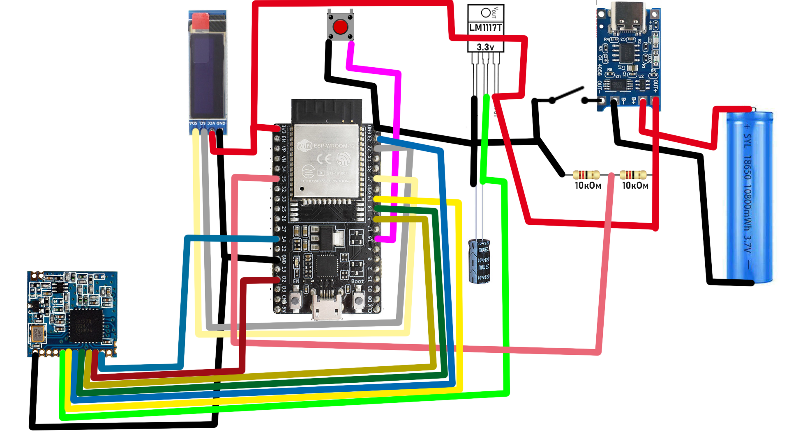

  
  <h1>ME-LO-RA NETWORK</h1>
  
<em>An anonymous mesh network for secure radio-based messaging</em>

---

## 📌 Table of Contents

- [What is it?](#-what-is-it)
- [Why is it needed?](#-why-is-it-needed)
- [Project foundation](#-project-foundation)
- [How does it work?](#-how-does-it-work)
- [Security and encryption](#-security-and-encryption)
- [Technical limitations](#-technical-limitations)
- [What do you need to get started?](#-what-do-you-need-to-get-started)
- [Wiring diagram](#-wiring-diagram)
- [Modifications and customization](#-modifications-and-customization)
- [Key generation](#-key-generation)
- [Power supply and enclosure](#-power-supply-and-enclosure)
- [Background](#-background)
- [Important!](#-important)
- [Feedback](#-feedback)

---

## ❓ What is it?

**ME-LO-RA NETWORK** is a mesh network based on the **ESP32** microcontroller and **LoRa (SX1278)** radio module, designed for transmitting text messages between users over radio using:

- **RSA** asymmetric encryption,
- **SHA-256**-based digital signatures,
- Message delivery confirmation.

---

## 🛡️ Why is it needed?

This project enables **secure and anonymous** messaging when traditional communication channels are unavailable or disrupted (e.g., during mobile internet outages).

---

## ⚙️ Project foundation

- **Microcontroller**: ESP32  
- **Radio module**: LoRa SX1278  
- **Additional components**: OLED display, button.

---

## 🔄 How does it work?

- The ESP32 creates a Wi-Fi access point and hosts a web interface for sending/receiving messages.
- All messages are encrypted using **RSA** and digitally signed; message integrity is verified via **SHA-256**.
- The recipient validates the signature and decrypts the message.
- A **signed acknowledgment message** is sent back to confirm delivery, preventing third parties from spoofing receipt.
- The network operates on a **mesh** principle: messages can be relayed through intermediate nodes.

---

## 🔐 Security and encryption

- **Any RSA key length** is supported, but due to ESP32 performance constraints, **64–128 bits** are recommended.
- An additional security measure is a **limited and shuffled character set**. This set can be modified, but must be **synchronized among all chat participants** (not required for relaying).
- Public keys and aliases are broadcast publicly (e.g., via the ME-LO-RA broadcast channel).
- No network participant knows the true identity of the sender—only the recipient’s alias is visible.
- For enhanced security, it is recommended to remove all debugging output (e.g., `Serial.print` and `Serial.println`).

> ⚠️ **Warning**: Without synchronized character sets and ordering, message decryption between users will fail. It is recommended to leave these settings unchanged.

---

## 📏 Technical limitations

| Environment                 | Range       |
|-----------------------------|-------------|
| Dense urban area            | ~500 m      |
| Forest                      | ~1,000 m    |
| Line-of-sight               | up to 5,000 m |

- **Number of relays**: unlimited.

---

## 🚀 What do you need to get started?

1. Assembled device based on ESP32 + LoRa SX1278.
2. A unique **alias** (nickname). If aliases collide, messages from others will appear corrupted and unreadable.
3. A generated **RSA key pair** (public and private).
4. Exchange your **public key** and **alias** via a public channel (e.g., ME-LO-RA broadcast).

> The more network participants know your public key and alias, the more effective mesh relaying becomes.

---

## 🔌 Wiring diagram

> ⚠️ **Caution**: The shown ESP32 power supply schematic is **not recommended**. Use at your own risk!

> ✅ **Recommendation**: Power the ESP32 via the **5V/VIN** pin using a boost converter to 5 V. If unavailable, connect the battery directly to **5V/VIN**. In this case, the controller will shut down at ~3.9 V battery voltage but will not be damaged.

### LoRa SX1278

| ESP32 | LoRa SX1278 |
|-------|-------------|
| GND   | GND         |
| D5    | NSS         |
| D2    | DIO0        |
| D18   | SCK         |
| D19   | MISO        |
| D23   | MOSI        |
| D14   | RST         |

> ⚠️ **Never power** the LoRa module from the ESP32’s built-in **3.3V regulator**, as this may damage the controller.

### OLED

| ESP32 | OLED |
|-------|------|
| 3.3V  | VCC  |
| GND   | GND  |
| D22   | SCL  |
| D21   | SDA  |

### Button

| ESP32 | Button |
|-------|--------|
| D16   | Contact 1 |
| GND   | Contact 2 |

- **D35** – pin for measuring battery charge level, connected via a voltage divider as shown in the diagram. Higher-value resistors (e.g., 50 kΩ) may be used.

---

## 🎨 Modifications and customization

The project is easily adaptable to your needs:
- The web interface can be fully customized (styles, logic, etc.).
- Just ensure the **POST request structure** to the ESP32 remains unchanged.

---

## 🔑 Key generation

A Python script is included in the repository to generate RSA keys using prime numbers up to **31 bits**.  
Finding large primes is computationally intensive, so simplified primality tests may be used.

---

## 🔋 Power supply and enclosure

- The enclosure is designed for through-hole mounting (a compact PCB version is planned) and uses a **18650 battery** as the power source.
- A **3D model of the enclosure** is included in the repository—you can 3D-print it.
- Screws used: **M5 × 12 mm**. To install them, insert or press nuts into the corresponding slots in the enclosure.
- Before installing the ESP32 into the enclosure, it’s recommended to add an internal duplicate **"Boot" button** for convenient firmware updates.

---

## 📜 Background

The idea emerged during widespread mobile internet outages in Russia.  
ME-LO-RA is a response to the need for an **independent, anonymous, and secure** messaging system during digital “shutdowns.”

---

## ⚠️ Important!

This project is developed **by a single person** and is provided **“as is.”** Use it **entirely at your own risk**.

---

## 📬 Feedback

- **Email**: [ourmail20210422@gmail.com](mailto:ourmail20210422@gmail.com)
- **Telegram**: [@TO_21_21](https://t.me/TO_21_21)

---

> 🌐 *ME-LO-RA NETWORK – communication freedom without intermediaries.*
