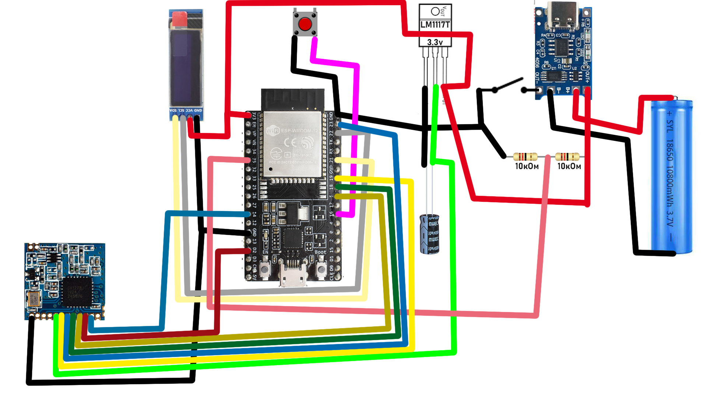

# ME-LO-RA NETWORK #
## Быстрый гайд ##

----------
### Что это? ###
MESH-based сеть для передачи сообщений между абонентами по радио-каналу через ассиметричное **RSA** шифрование, гарантией доставки сообщений и цифровой подписью.
### Зачем это нужно? ###
Безопасная анонимная передача сообщений по радио-каналу с защитой шифрованием.
### Что лежит в основе? ###
Основой данного проекта является микроконтроллер esp-32 и радио-модуль Lo-Ra SX1278.
### Как это работает? ###
Платформа espressif отвечает за веб-клиент, развернутый на wi-fi точке esp-32, а также шифрование и дешифрование сообщений.
Для гарантии доставки сообщений адресату используется **sha-256** сумма и цифровая подпись, основанная на RSA и защищающая от подмены отправителя.
Обратная подпись ответного сообщения о доставке защищает от подмены факта доставки третьей стороной.
### Насколько встроенное шифрование мощное? ###
Зависит от использованной битности ключей, в теории код поддерживает любую битность ключа, но мощность микроконтроллера на практике за адекватное время шифрования позволит использовать лишь 64 бита (точно потолок не известен, не тестировал). Дополнительной мерой защиты можно считать ограниченный и перемешанный набор символов в устройстве (при желании его можно сменить, но набор и порядок символов необходимо синхронизировать со всеми абонентами с которыми вы переписываетесь, для работы ретрансляции это не обязательно).
### Каковы пределы? ###
Если говорить о дальности, то все зависит от конкретного модуля Lo-Ra и используемых настроек. У меня получилось что-то около 500 метров в условиях плотной городской застройки, тесты других пользователей показывают дальность в 5000 м в условиях прямой видимости и ~1000 м в условиях леса.
Что касается косвенной дальности (с ретрансляцией), то дальность не ограничена по количеству звеньев в ней. Проблема состоит только в потере пакетов в середине сообщения (в остальных случаях такое битое сообщение будет отсеяно).

----------
## Что нужно для старта? ##

1. Собранное устройство.
2. Псевдоним (никнейм). (При коллизии имен чужое сообщение будет отброшено как битое)
3. Сгенерировать пару закрытый и октрытый ключ (чем больше простые числа в основе, тем безопаснее, но медленнее).
4. Поделиться открытой частью ключа (e-экспонента и модуль), а также псевдонимом через любой открытый канал (например широковещательный канал ME-LO-RA без шифрования), это нужно не только для переписки, но и для работы mesh-сети. Чем больше абонентов знают эти данные, тем лучше работа сети.

----------
## Предыстория ##
Идея проекта родилась у меня во время массовых отключений мобильного интернета в РФ, в том числе в моем регионе. Также из-за паранойи об анонимности передачи сообщений в период шатдаунов.

----------
## Моддинг? ##
Я старался сделать так, чтобы каждый мог легко модифицировать его под себя, в том числе вид web-UI. Его можно модифицировать как угодно на свой вкус, главное сохранить POST-запросы.

----------
## Генерация ключей? ##
Я приложил python код для генерации случайного ключа на основе простых чисел до 31 бита. Добыча простых чисел та еще задача, так что добывайте их сами, используя более простые проверки, нежели в моем коде.

----------
## Схема ##

Здесь представлена *НЕПРАВИЛЬНАЯ* схема питания ESP-32, у меня микроконтроллер работает и не кашляет, но для стабильности рекомендуется подлючать питание к пину 5V/VIN (в таком случае он будет отключаться при напряжении батареи порядка 3.9 В, но точно не сгорит) или использовать повышающий преобразователь на 5V. *ИСПОЛЬЗУЙТЕ ЭТУ СХЕМУ НА СВОЙ СТРАХ И РИСК*

|ESP-32|Lo-Ra SX1278|
|----------|----------|
|3.3v|3.3v|
|GND|GND|
|D5|NSS|
|D2|DIO0|
|D18|SCK|
|D19|MISO|
|D23|MOSI|
|D14|RST|

ESP-32|OLED|
|----------|----------|
|3.3v|Vcc|
|GND|GND|
|D22|SCL|
|D21|SDA|

ESP-32|Button|
|----------|----------|
|D16|1|
|GND|2|

D35 - пин датчика уровня заряда.

----------
## Корпус для печати? ##
Лежит внутри проекта.

----------
# Проект разрабатывается в одиночку и предоставляется в сыром виде, как есть. Используйте только на свой страх и риск. #

----------
## Мои контакты для обратной связи ##
Email: ourmail20210422@gmail.com

Telegram: t.me/TO_21_21